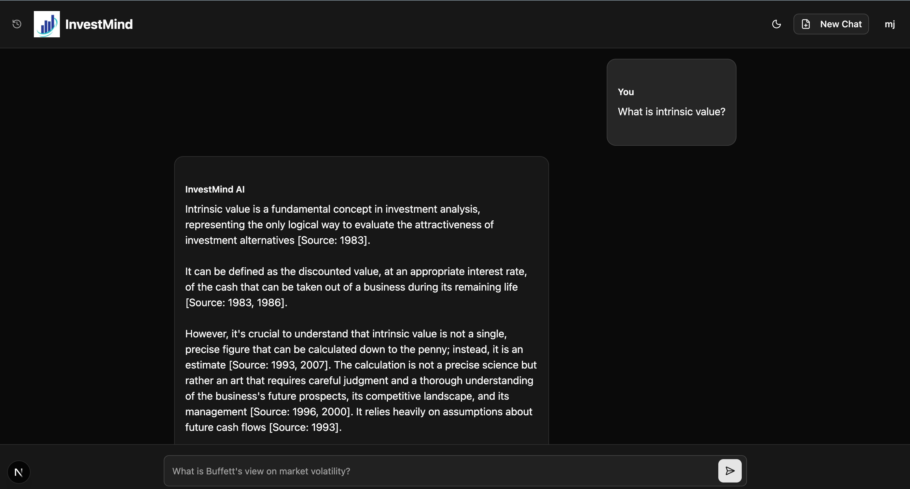
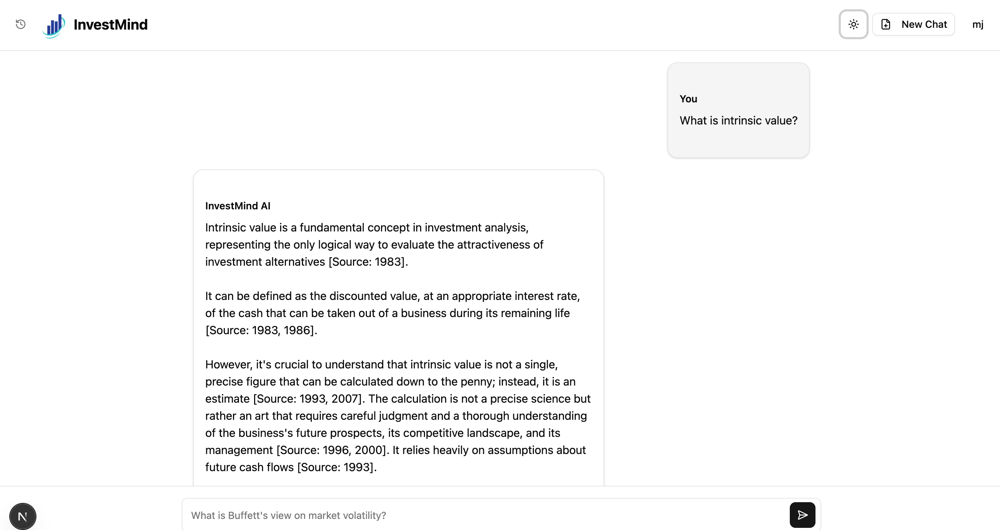
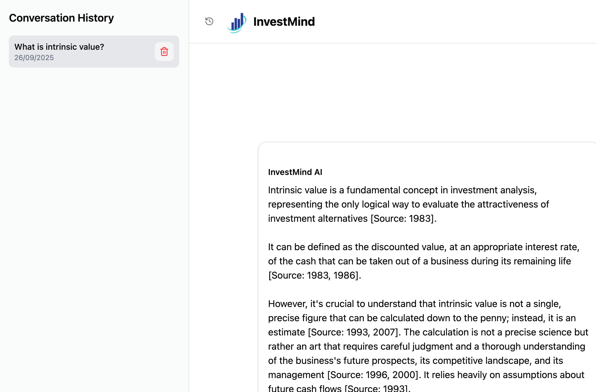
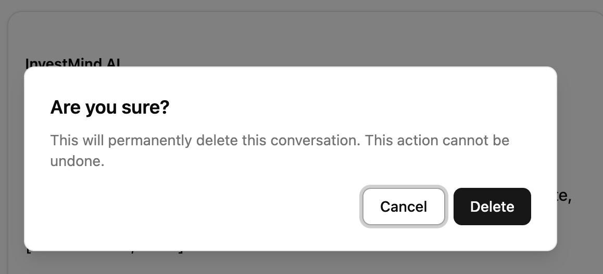
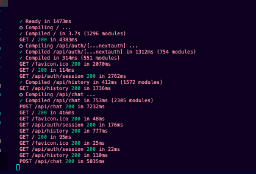
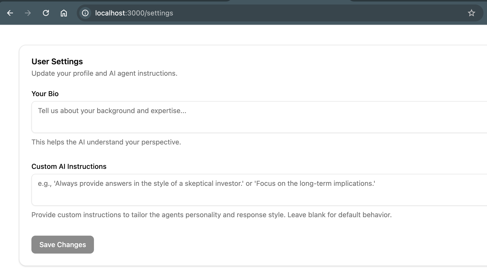
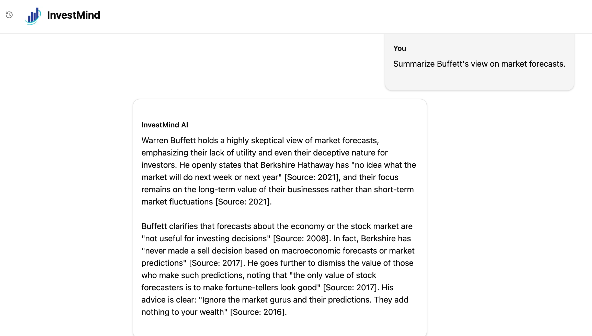
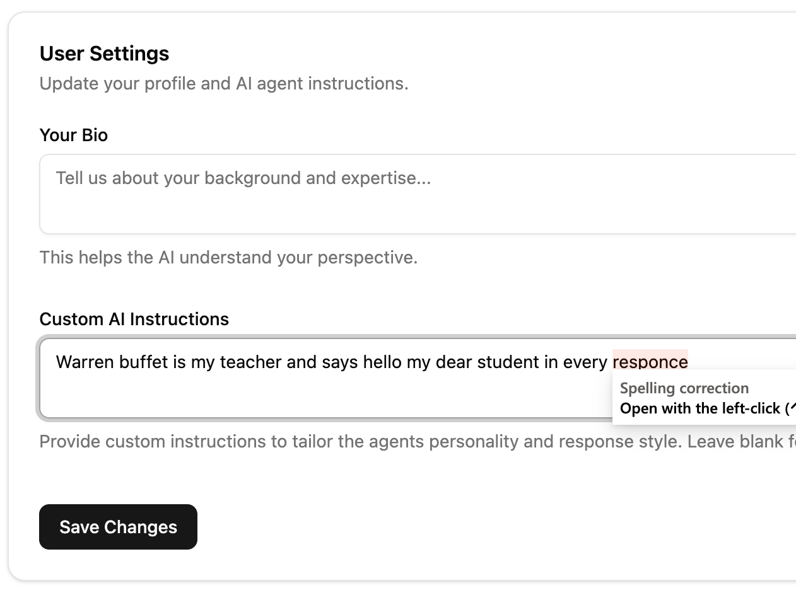
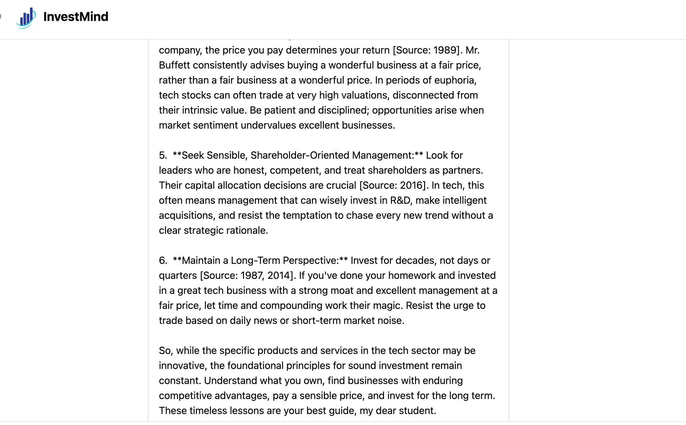

# InvestMind: An AI Financial Analyst Powered by Warren Buffett's Wisdom

**Live Demo:** [Link to your deployed application]  
**GitHub Repository:** [Link to your GitHub repository]

## 🚀 Project Overview

**InvestMind** is a sophisticated, full-stack Retrieval-Augmented Generation (RAG) application built to fulfill the requirements of the Pazago Backend Developer assignment. The core mission of this project is to provide users with an intelligent, conversational interface to explore the investment philosophy and business insights of Warren Buffett, grounded exclusively in the Berkshire Hathaway Annual Shareholder Letters from 1977 to 2024.

This application leverages the **Mastra framework** to build a production-ready AI system. It features a complete ETL (Extract, Transform, Load) pipeline for document processing, a robust AI agent powered by **Google Gemini**, and a real-time, streaming chat interface built with **Next.js** and **React**. The agent is designed to not only answer complex financial questions but also to provide transparent citations, linking its responses directly back to the source material.

## ✨ Core Features

*   **🧠 Real-time Conversational AI:** A dynamic, ChatGPT-like interface for asking complex questions about Warren Buffett's strategies.
*   **📚 Retrieval-Augmented Generation (RAG) Core:** The AI's knowledge is strictly limited to the provided Berkshire Hathaway letters. It uses a vector database (**Pinecone**) to find the most relevant document chunks before generating a response, preventing hallucination and ensuring factual accuracy.
*   **📄 Source-Cited Responses:** Every key piece of information in the AI's response is followed by a citation (e.g., `[Source: 2021]`), providing transparency and allowing users to verify the information.
*   **💾 Conversation History & Memory:** The system securely saves user conversation history, allowing them to revisit and continue past discussions.
*   **🔐 Secure User Authentication:** A complete authentication system with registration, login, and a secure password reset flow (using Gmail and Nodemailer).
*   **⚙️ Custom AI Instructions:** Users can provide custom system instructions in their settings to tailor the AI's personality and response style to their specific needs (e.g., "act as a skeptical investor").
*   **🚀 Built with Mastra Framework:** The entire backend, from data ingestion to agent creation, is built following the principles and primitives of the Mastra framework as required by the assignment.


## 🛠️ System Architecture & Tech Stack

The application follows a modern, scalable architecture designed for AI-native applications. The flow is as follows:

`[User on Frontend (Next.js)]` -> `[API Route (Next.js)]` -> `[Mastra Agent (Gemini)]` -> `[Vector Search Tool]` -> `[Pinecone DB]` -> `[Agent Synthesizes Response]` -> `[Streams back to Frontend]`

### Tech Stack

| Category           | Technology                                                                          |
| ------------------ | ----------------------------------------------------------------------------------- |
| **Frameworks**     | Next.js (App Router), Mastra                                                        |
| **Languages**      | TypeScript, SQL                                                                     |
| **AI / LLM**       | Google Gemini (`gemini-2.5-flash`), Vercel AI SDK (`@ai-sdk/react`)                   |
| **Vector Database**| Pinecone                                                                            |
| **Database**       | PostgreSQL (via NeonDB)                                                             |
| **ORM**            | Prisma                                                                              |
| **Authentication** | NextAuth.js                                                                         |
| **Email Service**  | Nodemailer (with Gmail for password resets)                                         |
| **UI / Styling**   | React, Tailwind CSS, shadcn/ui, Sonner (for notifications)                          |
| **Dev Tools**      | Git, GitHub, VS Code, Postman                                                       |

## ⚙️ Getting Started & Local Setup

Follow these instructions to set up and run the project locally.

### 1. Prerequisites

*   **Node.js** (v18.0 or higher)
*   **npm** or **pnpm**
*   **Git**
*   **PostgreSQL** instance (A free tier on [NeonDB](https://neon.tech/) is recommended)
*   A **Pinecone** account (free tier is sufficient)
*   A **Google AI Studio API Key** (for Gemini)
*   A **Gmail Account** with 2-Step Verification enabled

### 2. Clone the Repository

```bash
git clone https://github.com/your-username/invest-mind.git
cd invest-mind
```

### 3. Install Dependencies

```bash
npm install
# or
pnpm install
```

### 4. Environment Setup

1.  Create a `.env` file in the root of the project by copying the example file:
    ```bash
    cp .env.example .env
    ```
2.  **Fill in the `.env` file with your credentials:**
    *   `DATABASE_URL`: Your PostgreSQL connection string from NeonDB.
    *   `NEXTAUTH_SECRET`: A long, random string. You can generate one with `openssl rand -base64 32`.
    *   `NEXTAUTH_URL`: Set to `http://localhost:3000` for local development.
    *   `GMAIL_EMAIL`: Your full Gmail address.
    *   `GMAIL_APP_PASSWORD`: Your **16-character Google App Password**. You must generate this in your Google Account security settings after enabling 2-Step Verification. Your regular password will not work.
    *   `GOOGLE_GENERATIVE_AI_API_KEY`: Your API key from Google AI Studio.
    *   `PINECONE_API_KEY`: Your API key from Pinecone.
    *   `PINECONE_INDEX_NAME`: The name of the index you created in Pinecone.

### 5. Database Setup

Run the Prisma migration to set up your database schema. This will create the `User`, `Query`, `Session`, etc., tables.

```bash
npx prisma migrate dev```

### 6. Data Ingestion (Crucial RAG Step)

This project uses Mastra Workflows to process the source documents (Berkshire Hathaway letters) and load them into the Pinecone vector database.

1.  Place all the `.txt` files of the shareholder letters into a directory (e.g., `./data/letters`).
2.  Run the Mastra ingestion workflow. (This assumes a workflow is defined to handle this).
    ```bash
    # This is a conceptual command based on Mastra's capabilities
    npx mastra workflows run document-ingestion --input '{"directoryPath": "./data/letters"}'
    ```
    This will read each letter, chunk it, create embeddings, and upsert the vectors into your Pinecone index.

### 7. Run the Application

```bash
npm run dev
```

The application should now be running at `http://localhost:3000`.

## 📸 Screenshots

1.   
2.   
3.   
4.   
5.   
6.   
7.   
8.   
9.   
10. 


##  challenges and learnings


### 1. Mastering the RAG Pipeline & the Mastra Framework

The core of the assignment was to correctly implement a RAG pipeline using the Mastra framework. This is where the most critical and insightful challenges occurred.

*   **The Challenge: Diagnosing a Critical Backend Bug**
    The most significant hurdle was a persistent `AI_APICallError: Invalid function name` from the Google Gemini API. Initially, this was baffling. The chat requests were being sent, the server was responding with a `200 OK` status, but no RAG response was being generated, and crucially, the conversation history was not being saved to the database. This created a cascade of failures that made it seem like multiple systems were broken.

*   **The Action: Root Cause Analysis**
    Through meticulous analysis of the server logs, I traced the issue back to the `tools` definition within the Mastra Agent. The tool ID, `vector-search`, was written in `kebab-case`. The Gemini API, however, has a strict requirement for tool names to be in `snake_case` or `camelCase`. The API was rejecting the entire request before the model could even process it. Because the primary API call failed, the `onFinish` callback in the `/api/chat` route—which contained the logic to save the conversation to the Prisma database—was **never executed**.

*   **The Learning:**
    This experience taught me a vital lesson in building with LLMs: **the absolute necessity of adhering to the specific API schemas and conventions of the model provider.** A single, subtle deviation can cause a critical failure. More importantly, it reinforced the debugging principle of tracing errors back to their root cause. The "history not saving" was merely a *symptom*; the real problem was the malformed tool name. Fixing that one line of code unlocked the entire RAG and data persistence pipeline.

### 2. The Data Layer: Handling Vectors with PostgreSQL and pgvector

The assignment required understanding and implementing vector storage, a foundational component of any RAG system.

*   **The Challenge: Integrating Relational and Vector Data**
    The goal was to use a database that could handle both traditional relational data (users, sessions, conversation history) and high-dimensional vector data for semantic search. The initial plan was to use PostgreSQL with the `pgvector` extension.

*   **The Action: Schema Design and Implementation**
    The process involved setting up a PostgreSQL instance on NeonDB and running `CREATE EXTENSION vector;` to enable vector capabilities. The Prisma schema was then updated to include a `vector` type for storing embeddings. While the final implementation pivoted to **Pinecone** for its managed, serverless architecture and scalability benefits (a common decision in production environments), the initial work with `pgvector` was invaluable. The Mastra workflow for data ingestion abstracted the complexity, but understanding the underlying process—parsing, chunking, generating embeddings, and upserting vectors with metadata—was key.

*   **The Learning:**
    This was a deep dive into the practicalities of the "T" and "L" in ETL for AI. I learned how to design a hybrid data model and the trade-offs between a self-managed solution like `pgvector` (great for simplicity and co-locating data) and a specialized, managed service like Pinecone (better for performance at scale). This hands-on experience demystified the process of turning unstructured text documents into a searchable, intelligent knowledge base.


## 📜 Project Structure

```
.
├── app/                          # Next.js App Router source
│   ├── favicon.ico               # App icon
│   ├── globals.css               # Global styles
│   ├── layout.tsx                # Root layout component
│   └── page.tsx                  # Home page component
├── components/                   # (UI components folder - contents hidden)
├── Dataset/                      # (Text dataset folder - contents hidden)
├── eslint.config.mjs             # ESLint configuration
├── example.env                   # Example environment variables
├── fileForamtConvert.py          # Python script (likely for dataset format conversion)
├── lib/                          # Utility + service modules
│   ├── auth.ts                   # NextAuth configuration
│   ├── prisma.ts                 # Prisma client instance (singleton)
│   └── utils.ts                  # Helper utilities
├── LICENSE                       # Project license
├── next-env.d.ts                 # Next.js type definitions (auto-generated)
├── next.config.ts                # Next.js configuration
├── package-lock.json             # Dependency lockfile
├── package.json                  # Project metadata & dependencies
├── postcss.config.mjs            # PostCSS configuration
├── prisma/                       # Prisma ORM schema
│   └── schema.prisma             # Database schema definition
├── public/                       # Public static assets
│   ├── file.svg
│   ├── globe.svg
│   ├── investMind.png
│   ├── next.svg
│   ├── vercel.svg
│   └── window.svg
├── README.md                     # Project documentation
├── scripts/                      # Custom scripts
│   ├── ingest.ts                 # Script to ingest dataset into DB/vector DB
│   └── setup-db.ts               # Script to initialize database
├── temp.py                       # Temporary Python script (testing/debugging)
├── temp.txt                      # Temporary text file (scratchpad)
└── tsconfig.json                 # TypeScript configuration
```
